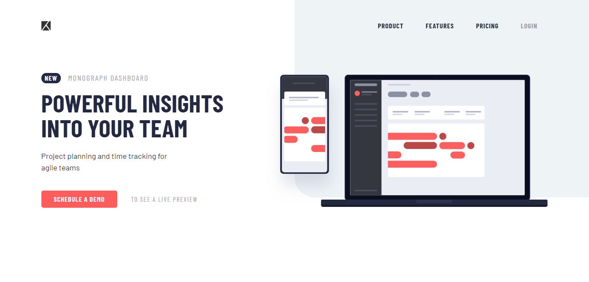

# Project tracking intro component

## Welcome! 👋

Thanks for checking out this front-end coding project.

## The project

Here I have built out this intro component.

You should be able to:

- View the optimal layout for the site depending on their device's screen size
- See hover states for all interactive elements on the page

## My process

### Built with

- Semantic HTML5 markup
- BEM
- CSS custom properties
- SASS
- Flexbox
- CSS Grid
- Mobile-first workflow
- Javascript
  - addEventListener
  - querySelector
